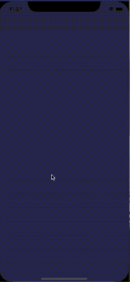

Strangers ( Github API)
===================


[](https://developer.apple.com/iphone/index.action)
[](https://developer.apple.com/swift)
[](http://mit-license.org)
[]()

## 🏃‍♂️ Getting Started

``` bash
git clone https://github.com/robihamanto/githubuser.git
cd Papr
pod install
open Papr.xcworkspace # or xed .

- Run (⌘ + R) or
- Test (⌘ + U)
```

## 👨🏻‍💻 Strangers

Fetching users on github, and display the user details

## 🎉 How am I building this?
1. Using [`RxSwift`](https://github.com/ReactiveX/RxSwift) 🔥
2. `MVVM` + `Coordinator` + `Pagination`
3. Using `Codable`, [`Moya`](https://github.com/Moya/Moya), [`Kingfisher`](https://github.com/onevcat/Kingfisher).
4. Exploring [Github](https://github.com) and its [API](https://developer.github.com/v3/)
5. Fun thing!

## 📱 Preview

